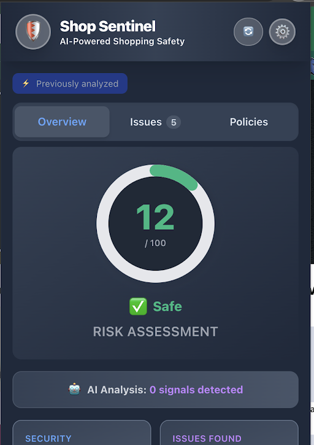
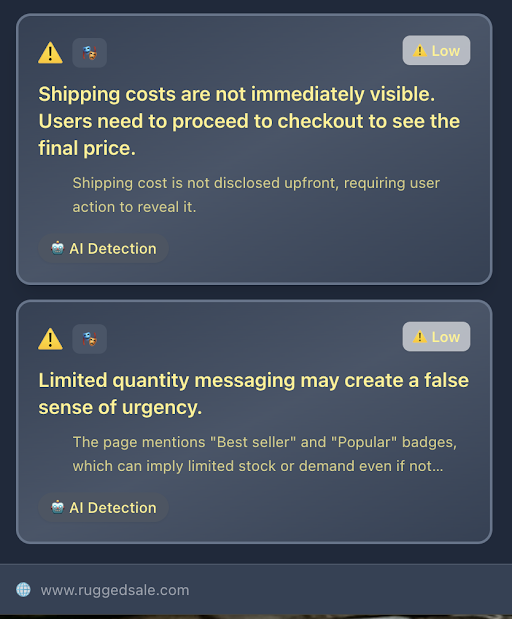

# Shop Sentinel 🛡️

> **AI-Powered Chrome Extension for E-Commerce Safety Analysis**

Shop Sentinel is a Chrome Extension that protects online shoppers by analyzing e-commerce websites for dark patterns, security vulnerabilities, legitimacy concerns, and policy issues. Built with Chrome's built-in Gemini Nano AI model, it provides real-time risk assessments directly in your browser.

## 🎯 Problem We're Solving

Online shopping scams and deceptive practices are increasingly sophisticated. Consumers lose billions annually to:
- **Dark patterns** - Manipulative UI designs that trick users
- **Phishing sites** - Fake websites impersonating legitimate brands
- **Hidden costs** - Surprise fees discovered at checkout
- **Poor policies** - Unclear return/refund terms that leave buyers vulnerable
- **Security risks** - Unsecure connections and suspicious domains

Shop Sentinel addresses these challenges by providing instant, AI-powered analysis that helps users make informed shopping decisions.

## 📸 Screenshots

### Getting Started

#### Ready to Analyze


*The Shop Sentinel extension popup, showing it's ready to scan the current page for security issues, dark patterns, and policy concerns. Users can click "Scan Page" to begin instant analysis.*

#### Analysis in Progress - Real-Time AI Processing


*Real-time progress tracking showing the extension analyzing a website in phases: AI initialization → Dark pattern detection → Domain analysis → Legitimacy checks. Users can see exactly what's being checked, with progress indicators like "Domain Analysis" at 42% and "Analyzing for brand impersonation..."*

### Risk Assessment & Overview

#### High Risk Detection - Suspicious Site Warning


*Shop Sentinel flags a suspicious e-commerce site (ruggedale.com) with a high risk score of 79/100. The extension detects multiple critical issues including brand impersonation (85% confidence that it mimics 'ruggedsociety.com'), missing contact information, and other legitimacy concerns. Users see clear warnings before making purchases.*

#### Safe Site Verification - Trustworthy Shopping


*For legitimate sites like Amazon, Shop Sentinel confirms safety with a low risk score (12/100) and green "Safe" status. The extension verifies security (HTTPS), domain authenticity, and shows "AI Analysis: 0 signals detected", giving users confidence to shop securely.*

#### Overview Dashboard - Complete Risk Summary



*The main dashboard showing comprehensive risk assessment: security status (HTTPS verified), AI analysis summary (3 signals detected), and top issues with severity indicators. Users get an instant overview of site safety before engaging with the website.*

### Issue Detection & Dark Patterns

#### Issues Tab - Detailed Problem Breakdown


*Complete list of detected issues including invalid social media profiles (High severity), missing contact information (Medium severity), and security vulnerabilities. Each issue includes severity badges, detailed explanations, and analysis type (Heuristic or AI Detection).*

#### Dark Pattern Detection - Manipulative Tactics


*The extension identifies manipulative UI patterns like "Limited quantity messaging may create a false sense of urgency" and "Shipping costs are not immediately visible." AI analysis explains how these tactics pressure users into rushed decisions or hide important information until checkout.*

#### Hidden Costs & Urgency Warnings


*Shop Sentinel detects multiple dark patterns on ruggedale.com: limited-time offers creating false urgency ("INCREDIBLE PRICE", "discounted prices") and potential hidden costs in the checkout process. Both issues are flagged with "Low" severity warnings and attributed to AI Detection.*

### Policy Analysis & AI Summarization

#### Policy Detection - Available Policies


*The "Policies" tab shows detected policy documents on an e-commerce site. Shop Sentinel identifies Return/Refund Policy, Shipping Policy, and Privacy Policy, each with a "View →" button for detailed analysis. This feature prepares policies for AI-powered summarization.*

#### Policy Analysis - AI Summarization in Action (Walmart)


*When visiting a policy page (Walmart's Customer Privacy Center), Shop Sentinel's AI analyzes and summarizes complex terms. The extension flags "Policy Quality Concerns" (minimal content, legitimacy score 70/100) and provides an AI-generated summary highlighting key points about privacy rights, data management, and regional variations.*

#### Policy Summary with Quality Assessment (Flipkart)


*Another example showing AI-powered policy analysis on Flipkart's privacy policy. The extension provides a detailed legitimacy score (78/100), warns about minimal content (< 380 words), and generates bullet-point summaries of key terms and conditions, making complex policies easy to understand.*

### Security & Phishing Prevention

#### Phishing Detection - Brand Impersonation


*Shop Sentinel's AI detects domain impersonation attempts. On ruggedale.com, the extension identifies that the domain "appears to impersonate 'ruggedsociety.com' (85% confidence)" and flags missing critical contact information. This protects users from fraudulent sites mimicking legitimate brands.*

#### Multiple Security Issues Detected


*The Issues tab displaying multiple security and legitimacy concerns: low social media validation rate (0%), missing Terms of Service policy, and DNSSEC security vulnerability. Each issue includes severity levels (Medium/Low) and clear explanations of the risk.*

### Settings & Configuration

#### Analysis Settings Panel


*The Settings panel allows users to configure protection features. "Smart Scam Detection" toggle enables AI-powered analysis to find hidden tricks and fake reviews. Additional preferences include theme selection (Light/Dark/Auto) and risk alert notifications for risky sites.*

## ✨ Key Features

### 🤖 AI-Powered Analysis (Chrome Built-in Gemini Nano)
- **Dark Pattern Detection** - Identifies deceptive UI designs and manipulative tactics
- **Domain Impersonation Analysis** - Detects phishing and brand mimicry attempts
- **Legitimacy Assessment** - Evaluates website trustworthiness using multiple signals
- **Policy Analysis** - Summarizes return/refund/shipping policies for clarity

### 🔒 Security Checks
- HTTPS validation and certificate verification
- Mixed content detection
- Suspicious URL pattern analysis
- Domain age verification (via WHOIS)

### 📄 Policy Detection & Summarization
- Automatic detection of policy pages (returns, shipping, privacy, terms)
- AI-powered summarization of key terms and conditions
- Risk factor identification in policy language

### 🎨 User Experience
- Real-time analysis with progress tracking
- Risk scoring (0-100) with visual indicators
- Detailed issue breakdown by category
- Cross-tab synchronization
- Intelligent caching for performance

## 🛠️ Chrome AI APIs Used

Shop Sentinel leverages **Chrome's Built-in AI Model (Gemini Nano)** through the following APIs:

### 1. **Prompt API (LanguageModel)** - Primary API
Used extensively throughout the extension for:

- **Dark Pattern Detection** (`src/services/ai.ts`)
  - Analyzes page content, headings, buttons, and forms
  - Uses RAG (Retrieval Augmented Generation) with vector search
  - Context-aware scoring based on domain trust signals
  - Detects: false urgency, forced continuity, hidden costs, trick questions, bait & switch, confirmshaming

- **Domain Impersonation Analysis** (`src/services/ai.ts`)
  - Analyzes domain names for phishing and brand mimicry
  - Considers trust signals (age, contact info, social media)
  - Identifies typosquatting and suspicious patterns
  - Returns risk level and reasoning

- **Legitimacy Assessment** (`src/services/ai.ts`)
  - Evaluates overall website legitimacy
  - Industry-specific analysis (e-commerce, SaaS, content)
  - Context-aware rules based on domain age and trust factor
  - Flags missing security features, contact info, and policies

- **Policy Analysis** (`src/services/policyDetection.ts`)
  - Summarizes policy documents (returns, shipping, privacy, terms)
  - Extracts key points, risk factors, and trust signals
  - Identifies vague language and consumer-unfriendly terms

### 2. **Summarizer API** - Secondary API
Used for specialized summarization tasks:

- **Policy Summarization** (`src/services/policyDetection.ts`)
  - Creates key-point summaries of policy documents
  - Extracts return windows, costs, and important conditions
  - Falls back to LanguageModel API if unavailable

- **Semantic Fingerprinting** (`src/services/fingerprint.ts`)
  - Generates semantic summaries for site change detection
  - Enables intelligent cache invalidation

### Implementation Details

- **Session Management**: Persistent AI sessions to avoid repeated model initialization
- **Caching**: Results cached for 30 minutes to reduce API calls
- **Error Handling**: Graceful fallbacks when AI is unavailable
- **Availability Detection**: Checks for model availability and guides users to enable Chrome AI flags

## 🚀 Getting Started

### Prerequisites

- **Node.js** v18 or higher
- **Google Chrome** (Chrome Canary 128+ or Chrome Dev recommended for AI features)
- **Chrome AI Setup**:
  1. Enable `chrome://flags/#optimization-guide-on-device-model`
  2. Enable `chrome://flags/#prompt-api-for-gemini-nano`
  3. Restart Chrome and wait for model download (~2GB)

### Installation

1. **Clone the repository**
   ```bash
   git clone https://github.com/yourusername/shop-sentinel.git
   cd shop-sentinel
   ```

2. **Install dependencies**
   ```bash
   # Install frontend dependencies
   npm install
   
   # Install backend dependencies
   cd backend
   npm install
   cd ..
   ```

3. **Configure backend** (optional, for domain verification)
   ```bash
   cd backend
   cp .env.example .env
   # Edit .env and add your WHOIS API key (optional)
   ```

4. **Build the extension**
   ```bash
   npm run build
   ```

5. **Load in Chrome**
   - Go to `chrome://extensions/`
   - Enable "Developer mode" (toggle in top-right)
   - Click "Load unpacked"
   - Select the `dist` folder

### Development

```bash
# Run frontend development server
npm run dev

# Run backend server (optional)
cd backend
npm run dev

# Or run both concurrently
npm run dev:full
```

## 📖 Usage

### How Shop Sentinel Protects You

1. **Browse Any E-Commerce Site** - Navigate to any online store
2. **One-Click Protection** - Click the Shop Sentinel icon in your toolbar
3. **Instant Analysis** - AI scans for scams, dark patterns, and risks in seconds
4. **Get Clear Warnings** - See risk scores and detailed explanations
5. **Make Informed Decisions** - Understand what's safe before you shop

### Real-World Protection Examples

**Scenario 1: Suspicious New Website**
- Extension detects: New domain (< 6 months old), missing contact info, no return policy
- Result: High risk warning (65/100) - User avoids potential scam

**Scenario 2: Dark Pattern Detection**
- Extension detects: Fake countdown timer, false scarcity ("Only 2 left!")
- Result: Warning about manipulative tactics - User makes informed decision

**Scenario 3: Policy Review**
- User navigates to return policy page
- Extension summarizes: "30-day returns, but 15% restocking fee on electronics"
- Result: User knows key terms before purchasing

**Scenario 4: Phishing Attempt**
- Extension detects: Domain mimics legitimate brand (typosquatting)
- Result: Impersonation warning - User avoids fake website

### Settings

Access settings via the ⚙️ icon:
- **Smart Scam Detection**: Toggle AI-powered analysis
- **Theme**: Light, dark, or auto
- **Risk Alerts**: Enable notifications for risky sites

## 🏗️ Project Directory

```
shop-sentinel/
├── src/
│   ├── components/          # React UI components
│   ├── services/           # Core analysis services
│   │   ├── ai.ts           # LanguageModel API integration
│   │   ├── policyDetection.ts  # Summarizer API integration
│   │   ├── pageAnalyzer.ts # Main analysis orchestrator
│   │   └── ...
│   ├── content/            # Content script for page analysis
│   ├── popup/              # Extension popup UI
│   └── service-worker.ts   # Background worker
├── backend/                # Optional Node.js backend
│   ├── server.js          # Express API server
│   └── services/          # Job queue, WebSocket, etc.
└── dist/                   # Built extension (after npm run build)
```

## 🔧 Technology Stack

- **Frontend**: React 19, TypeScript 5, Vite 7, TailwindCSS 4
- **Chrome Extension**: Manifest V3
- **AI**: Chrome Built-in Gemini Nano (LanguageModel + Summarizer APIs)
- **Backend** (optional): Node.js, Express, PostgreSQL, WebSockets
- **State Management**: Zustand
- **Vector Search**: Custom implementation for RAG

## 📊 How It Works

1. **Page Analysis Trigger**: User clicks "Scan Page" in popup
2. **Content Extraction**: Content script extracts page data (headings, buttons, forms, text)
3. **Heuristic Checks**: Fast rule-based checks for security, policies, contact info
4. **AI Analysis** (if enabled):
   - Dark pattern detection via LanguageModel API
   - Domain impersonation analysis via LanguageModel API
   - Legitimacy assessment via LanguageModel API
   - Policy summarization via Summarizer API (with LanguageModel fallback)
5. **Risk Calculation**: Combines all signals into 0-100 risk score
6. **Results Display**: Shows risk level, issues, and recommendations

## 🧪 Testing Instructions

To test Shop Sentinel:

1. **Install the extension** (see Installation above)
2. **Enable Chrome AI flags** (see Prerequisites)
3. **Test on various sites**:
   - **Safe sites**: Amazon, eBay, Walmart
   - **Risky sites**: Test with suspicious domains (exercise caution)
   - **Policy pages**: Navigate to `/returns`, `/shipping`, `/privacy` pages
4. **Verify AI functionality**:
   - Open DevTools console (F12)
   - Look for "🤖 Chrome AI Capabilities" log
   - Check for "✅ AI session created" messages
5. **Check results**:
   - Risk scores should appear (0-100)
   - Issues tab should list detected problems
   - Policies tab should detect policy pages

### Test Cases

- ✅ **Dark Pattern Detection**: Visit sites with countdown timers, limited stock messages
- ✅ **Domain Analysis**: Test with new domains vs. established domains
- ✅ **Policy Detection**: Navigate to return/shipping policy pages
- ✅ **Security Checks**: Test with HTTP vs. HTTPS sites


## 📄 License

This project is licensed under the MIT License - see [LICENSE.md](LICENSE.md) for details.

---

**Made with ❤️ to make online shopping safer for everyone**
